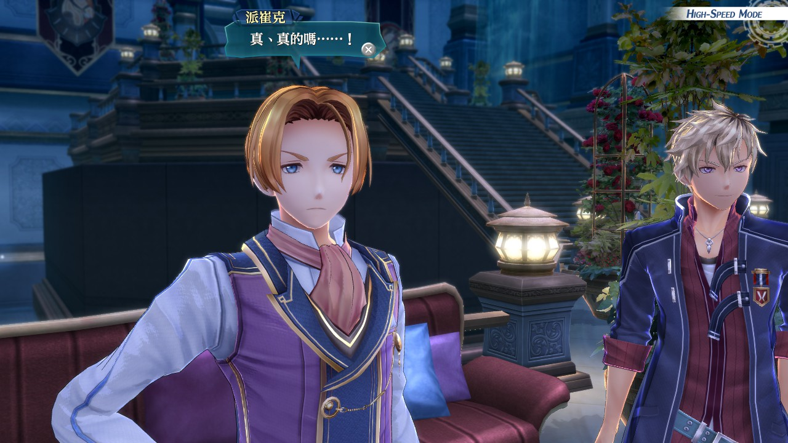

写这篇的时候，已经是凌晨四点半。

其实我不算真正打通关「闪之轨迹」，「闪之轨迹Ⅳ」我还有六个奖杯没有拿到，可能我彻底写完这一篇的时候，才全部完成白金的收集。

总结一下，我玩下来最大的感受就是：**敷衍。**

## 第一段重度游戏经历

我不算是有耐心的类型，就算是玩游戏玩手机我的脑子也会跳来跳去。稍有难度我就会立刻逃跑，所以直到目前二十几年的鲨鱼生活中，我都从来没有尝试过去通关一款游戏的最高难度，也没有高强度地为了一款游戏全收集去打过二周目通关。

虽然拿到了不少游戏的白金奖杯/全成就，比如一年前通关的「女神异闻录5皇家版」，但也只是一周目出了头，二周目即将结束，然后我就不再继续往下打了。

在打「英雄传说」之前，我很难想象我为了一部游戏花费将近三百小时，很难想象我碰到打不过的NightMare模式隐藏BOSS之后会死磕到底。 
 
所以也不难看出我应该是很喜欢这个系列，喜欢到就算后面全是垃圾我也花了将近五百小时去打通「闪之轨迹」。

## 早听说过「闪之轨迹」不太行，没想到这么不行

玩「英雄传说」的时候，我一向是真香玩家。

就「轨迹系列」来说，目前已经有了四代主角，分别是不同的四个地区的出身。每一个主角故事结束之后，我都得花一段时间去接受新主角。

在我接受新主角、新地区之前，失去了滤镜的我对新一阶段的游戏可以说是非常挑剔。每次刚开始新游戏，我都在象上骂骂咧咧地吐槽，所以一开始我感觉到自己并不喜欢「闪之轨迹Ⅰ」，还以为也只是我一时半会接受不了。 我安慰自己，之后我肯定要被精彩的剧情和人物故事的发展折服。

但我没想到，这里才是噩梦开始。

好吧也没有这么夸张，不过「闪之轨迹」的确让我很失望。

### 画面

#### 建模

FALCOM从「闪之轨迹Ⅰ」开始就转向了3D人物建模，对话框头像被无情替换。

时代的潮流嘛，我理解，但是我是坚定不移的2.5D Q版人物建模+对话框头像派。
  
让我无法忍受的，是「闪之轨迹Ⅲ」。

「闪之轨迹Ⅲ」的人物建模比起前两部来说简直是跨了一大步，角色的身材更修长，没有之前那么重的大头芭比娃娃感觉。

但是，我不太理解为什么建模能够在女性角色越来越可爱美丽的同时，让男性角色逐渐发福变秃。比较清秀的偏女性长相的男性角色还好，比较偏高大硬汉的类型那真是惨得流泪，我真的要为男性角色喊冤。 
 
  

我在上一代主角团里，除了主角之外最喜欢的一位男性角色兰迪，当时我是觉得主视觉图配不上这个角色的。我和朋友吐槽过说主视觉图的兰迪看起来有点胖有点油腻，而游戏里面剧情CG、爆发技能图以及对话框头像的兰迪，在我这里可以算是上一代角色里面美貌值前三的人物，我当时管兰迪喊**美女**。 

但是当我怀着激动的心情，准备好快速连续截图好迎接兰迪在「闪之轨迹Ⅲ」初登场的时候，在镜头转到他正脸的一瞬间——

我萎了。  

请问这位油腻的红发男是谁？

  
随即我发现不仅是曾经美女的兰迪惨遭毁容打击，在「闪之轨迹Ⅰ&Ⅱ」出场过的一位男性角色派崔克更是迎来秃顶危机。

我整整骂了一整部的人物建模…… 

不过女性角色真的越来越好看，给大家欣赏一下美女。 

#### OP画面

「闪之轨迹」开始，OP变成了两个。 前一个是刚进入游戏开场就可以看到的人物介绍开场，人物立绘+无歌词BGM；后一个是标准动画OP+演唱歌曲。

不知道为什么，「闪之轨迹」的动画OP是一部比一部敷衍。 

按理来说，按理来说，OP很重要，能不能抓我就看OP画的怎么样，毕竟你们FALCOM前有「伊苏」新海诚，后有「闪之轨迹Ⅰ」神秘立绘画师。 

然而「闪之轨迹Ⅲ」明明是2017年的作品，动画OP却直接把我打回2009年的「阿拉德战记」。

_我很喜欢「阿拉德战记」，但是我是说那个感觉一下就回去了。_

_我突然发现「阿拉德战记」OP比「闪之轨迹Ⅲ&Ⅳ」还精致一点耶！_ 

我可以接受比较古早的画风，我非常可以，我到现在还在沉迷「伊苏Ⅰ&Ⅱ」的OP，但是没想到你们直接敷衍我呀？穷你也不能这么敷衍我吧！

分享一下「伊苏Ⅱ」绝美亚特鲁。

你就算敷衍我，那你可不可以不要放那个精美人物立绘展示OP了，我刚看完美丽立绘然后突然被打到这个画风，有点心理落差也不算很过分吧？

我本来还抱着一部比一部进步的想法，没想到这个OP质量可以说是飞流直下，比我的股票还能跌。到了「闪之轨迹Ⅳ」就是一个无情的简陋，嗯……怎么说，如果FALCOM你就是想要这种风格的OP…… 

那、那也行吧，反正做都做了、看都看了，我能怎么办呢。

#### CG

这里的人物立绘不是指之前提到的OP精美立绘，也不是爆发技能的立绘，而是在剧情部分回忆起某个人物时候放出的不同阶段的立绘。

因为轨迹系列是按时间发展的，一些在前作出现过的角色与新作品角色有联系，提起来的时候就会浮现前作角色不同时间段的不同立绘形象，这很合理。

但是FALCOM，你能不能统一一下画风，你直接拿过来用，你是不是太敷衍我了?

_此处应该有雷克多不同阶段角色立绘对比，但是我好像当时没有截图，算了。_

这是「空之轨迹」剧情在「闪之轨迹Ⅲ」中重绘的CG↓  

这是「空之轨迹」原有的CG，然后直接拿来用在「闪之轨迹Ⅲ」里↓ 

#### 音乐

嗯，JDK的音乐没什么好挑剔的。

朋友们，走过路过，不要错过JDK的音乐。

除了一向发挥出色的各种背景音乐，更有我CP**生离死别的专属歌曲**。  

可能有剧透

<pre><code>
克洛之轨迹名不虚传。
</code></pre>

#### 机制/难度

想不到我居然也有因为难度太水而无语的一天！

「英雄传说：零/碧之轨迹」算是第一次让我心甘情愿打最高难度、并且打通之后感觉到无比满足的游戏。

_毕竟之前我从来不打最高难度。_

一代目的「空之轨迹」没有成就要求，没有过多的收集要素，所以没有必要一定打通最高难度。但是二代目的「零/碧之轨迹」开始加入了大量的成就和收集要素，其中就有**只有二周目才能挑战的隐藏boss**,以及**只有通关最高难度/二周目才能拿到的奖杯**，于是我不得不打。

从「空之轨迹」开始我就非常喜欢回合制+AT机制的感觉，并且不同导力回路可以组成不同的魔法，形成不同的打法；每个角色的技能都非常有特点，和人物性格极其贴合，算是人物塑造和游戏感互相成就。

但是到了「闪之轨迹」，我人傻了。

原本是根据不同回路拼凑属性数量达到解锁魔法技能要求的回路玩法被取消了，直接变成了安装魔法回路，省事的同时，如何在数量限制内凑成更多更高级更不同的魔法技能的快乐也省去了。

同时因为物理暴击流简单粗暴且快速，魔法流逐渐被我放弃了。

**拜托，两个键**_选中目标+确认_**能解决的怪，我为什么要用四个键**_选择魔法选项+选择魔法种类+选中目标+确认_**解决？**

我的确不是有耐心的玩家，我很容易对一个东西失去兴趣，所以——

玩到后面，我玩出了动作游戏无脑平A的感觉。

人物的技能也让我没什么心情深究，玩到现在，让我印象深刻的只有几个人物的典型技能，不像以前为了应对不同怪物不同弱点不同打法，熟记人物技能的感觉了。

**以前是这一个打法打不通，换一个打法试试，现在是一刀999，是兄弟就来砍我。**

#### 技能

想要在优秀的战斗系统上增加新花样，结果完全不行。

将原本出色的双人战技改成了意义并不大的连击，完全将羁绊可以发挥的地方完全抹掉了。

可以说我非常喜欢「零/碧之轨迹」和伙伴羁绊加深到一定程度突破/重大剧情点角色心态转变的时候，（双人）战技强化/（单人）战技突破，更加符合本来一直提出的武术境界的感觉，心态变了就会看到不一样的“理”嘛。

但很可惜到了「闪之轨迹」，这一部分做得非常敷衍，

#### 很没意思的小游戏

#### 廉价发廊和廉价服饰批发

#### 剧情

##### 人物羁绊

##### 站在世界中心拿稳龙傲天后宫男主剧本

##### 轻松打通任督二脉、领悟新技能的角色

##### 为了一个人的成长硬带两团新旧队友

###### “青出于蓝但敷衍地胜于蓝”的新队友

"空有气势却一无是处"的后起之秀

倔强少爷为何复制粘贴

###### 逐渐标签化的旧队友

##### 故事剧情

##### 口口相传的口头禅

## 恨，又没有完全恨

但「闪之轨迹」就算烂得我从头骂到尾、烂得我气得睡不着，但也不算完全烂。拼拼凑凑还是能想起一些我喜欢的地方。

### 很酷的新角色

#### 黄金罗刹

#### 黄昏后闪耀的千之阳炎

### 看到罗伊德，我觉得那个糟糕的一天就是为他出场这几秒钟而活

说到这里，FALCOM是不是超喜欢萝莉双马尾啊，为什么连琪雅酱也要双马尾……虽然也很可爱，但是披着头发的琪雅酱是软乎乎的狗狗，是世界的宝物……（垂泪.gif）

### 针锋相对的没头脑和不高兴

在「闪之轨迹Ⅰ」七月实训分组发表的时候，副班长马奇亚斯还会双手合十祈祷不要和尤西斯分到一组，好可爱啊哈哈哈哈哈！明明和好了一点但还是这么闹着别扭诶嘿！

好喜欢这个小细节！

### 命运一般的罗密欧与朱丽叶

### 靠塞前作内容做彩蛋

#### 哈梅尔BGM

#### 兰花塔BGM

#### 重磅回归的吃饭复刻料理